# Lab 02: PostgreSQL Configuration and Memory Management

## วัตถุประสงค์
1. เรียนรู้การกำหนดค่า PostgreSQL สำหรับการปรับประสิทธิภาพ
2. ทำความเข้าใจกับ Memory Components ต่างๆ ของ PostgreSQL
3. ปฏิบัติการปรับแต่งพารามิเตอร์หลักเพื่อเพิ่มประสิทธิภาพ
4. เรียนรู้การใช้งานไฟล์ configuration ต่างๆ
5. เข้าใจหลักการคำนวณค่าที่เหมาะสมสำหรับแต่ละพารามิเตอร์

## ทฤษฎีก่อนการทดลอง

### PostgreSQL Memory Architecture

PostgreSQL ใช้สถาปัตยกรรมหน่วยความจำแบบ shared memory และ per-process memory เพื่อเพิ่มประสิทธิภาพในการประมวลผล

#### Shared Memory Components

**1. Shared Buffers**
- **นิยาม**: หน่วยความจำส่วนกลางที่ใช้แคชหน้าข้อมูล (data pages) จากดิสก์
- **วิธีการทำงาน**: เมื่อมีการอ่านข้อมูล PostgreSQL จะตรวจสอบใน shared buffers ก่อน หากไม่พบจึงไปอ่านจากดิสก์
- **ผลกระทบ**: การตั้งค่าที่เหมาะสมจะลดการเข้าถึงดิสก์และเพิ่มความเร็วในการประมวลผล
- **แนวทางการตั้งค่า**:
  - **ระบบขนาดเล็ก (< 1GB RAM)**: 25% ของ RAM
  - **ระบบขนาดกลาง (1-4GB RAM)**: 25-40% ของ RAM
  - **ระบบขนาดใหญ่ (> 4GB RAM)**: ไม่เกิน 8-16GB (เนื่องจากประสิทธิภาพจะลดลงหลังจากนี้)
  - **สูตรคำนวณ**: `RAM × 0.25` แต่ไม่เกิน 8GB

**2. WAL Buffer (Write-Ahead Log Buffer)**
- **นิยาม**: หน่วยความจำที่ใช้เก็บข้อมูล WAL ก่อนเขียนลงดิสก์
- **วิธีการทำงาน**: ทุกการเปลี่ยนแปลงข้อมูลจะถูกบันทึกใน WAL buffer ก่อน จากนั้นจึง flush ลงดิสก์
- **ความสำคัญ**: ช่วยให้การ recovery เป็นไปอย่างถูกต้องและรวดเร็ว
- **แนวทางการตั้งค่า**:
  - **Default**: 1/32 ของ shared_buffers (ขั้นต่ำ 64kB, สูงสุด 16MB)
  - **ระบบที่มี Write intensive**: 16-64MB
  - **ระบบ OLTP**: 16-32MB
  - **สูตรคำนวณ**: `shared_buffers / 32` หรือ 16MB

**3. CLog Buffer (Commit Log Buffer)**
- **นิยาม**: เก็บรายการสถานะของธุรกรรม (committed, aborted, in-progress)
- **วิธีการทำงาน**: ช่วยในการติดตามสถานะธุรกรรมและการจัดการ MVCC
- **การปรับแต่ง**: มักจะปรับตัวอัตโนมัติตาม workload

**4. Vacuum Buffer**
- **นิยาม**: หน่วยความจำที่ใช้ในกระบวนการ vacuum
- **วิธีการทำงาน**: ใช้ในการทำความสะอาดข้อมูลที่ไม่ใช้แล้ว (dead tuples)
- **ความสำคัญ**: ป้องกันการ bloat ของตารางและอินเด็กซ์

#### Per-Process Memory Components

**1. Work Memory**
- **นิยาม**: หน่วยความจำที่แต่ละ connection ใช้สำหรับการดำเนินการ sort, hash, merge
- **วิธีการทำงาน**: 
  - ใช้สำหรับ ORDER BY, GROUP BY, Hash joins
  - หากข้อมูลเกินขนาด work_mem จะเขียนลงดิสก์ (spill to disk)
- **แนวทางการตั้งค่า**:
  - **สูตรพื้นฐาน**: `(RAM × 0.25) / max_connections`
  - **ระบบ OLTP**: 4-16MB
  - **ระบบ OLAP**: 256MB-1GB
  - **Data Warehouse**: 1-8GB
- **ตัวอย่างการคำนวณ**:
  ```
  RAM = 8GB, max_connections = 100
  work_mem = (8GB × 0.25) / 100 = 20MB
  ```

**2. Maintenance Work Memory**
- **นิยาม**: หน่วยความจำสำหรับงานบำรุงรักษา เช่น VACUUM, CREATE INDEX, REINDEX
- **วิธีการทำงาน**: ใช้ครั้งละหนึ่งการดำเนินการ ไม่เหมือน work_mem ที่อาจใช้หลายครั้งพร้อมกัน
- **แนวทางการตั้งค่า**:
  - **ควรมากกว่า work_mem อย่างน้อย 4-8 เท่า**
  - **ระบบเล็ก**: 64-256MB
  - **ระบบใหญ่**: 1-4GB
  - **สูตรคำนวณ**: `work_mem × 8` หรือ `RAM × 0.05-0.10`

#### Cache และ Planning Memory

**1. Effective Cache Size**
- **นิยาม**: การประมาณขนาดหน่วยความจำที่ระบบปฏิบัติการและ PostgreSQL ใช้สำหรับ cache รวมกัน
- **วิธีการทำงาน**: Query planner ใช้ค่านี้ในการตัดสินใจเลือกแผนการประมวลผล
- **ไม่ใช่การจองหน่วยความจำ**: เป็นเพียงข้อมูลสำหรับ planner เท่านั้น
- **แนวทางการตั้งค่า**:
  - **แนะนำ**: 50-75% ของ RAM ทั้งหมด
  - **ระบบที่มี application อื่นร่วมด้วย**: 50-60%
  - **ระบบที่ PostgreSQL เป็นหลัก**: 70-75%

### Configuration Files

#### 1. postgresql.conf
- **ตำแหน่ง**: `$PGDATA/postgresql.conf`
- **หน้าที่**: กำหนดค่าหลักของเซิร์ฟเวอร์
- **โครงสร้าง**:
  ```ini
  # Memory
  shared_buffers = 256MB
  work_mem = 16MB
  
  # WAL
  wal_buffers = 16MB
  
  # Query Planner
  effective_cache_size = 2GB
  ```

#### 2. postgresql.auto.conf
- **ตำแหน่ง**: `$PGDATA/postgresql.auto.conf`
- **หน้าที่**: เก็บการตั้งค่าจาก ALTER SYSTEM commands
- **ความสำคัญ**: Override ค่าใน postgresql.conf
- **ข้อดี**: การจัดการแบบ programmatic, การ version control

#### 3. pg_hba.conf
- **ตำแหน่ง**: `$PGDATA/pg_hba.conf`
- **หน้าที่**: Host-Based Authentication
- **โครงสร้าง**:
  ```
  # TYPE  DATABASE  USER      ADDRESS         METHOD
  local   all       postgres                  peer
  host    all       all       127.0.0.1/32    md5
  ```

#### 4. pg_ident.conf
- **หน้าที่**: แมป OS users กับ database users
- **ใช้งานร่วมกับ**: pg_hba.conf (ident authentication method)

### Memory Sizing Strategies

#### Strategy 1: Conservative Approach (ระบบที่มี application อื่น)

Total RAM = 8GB
shared_buffers = 1.5GB (18.75%)
work_mem = 16MB
maintenance_work_mem = 128MB
effective_cache_size = 4GB (50%)


#### Strategy 2: Aggressive Approach (ระบบที่ PostgreSQL เป็นหลัก)

Total RAM = 8GB
shared_buffers = 2GB (25%)
work_mem = 32MB
maintenance_work_mem = 512MB
effective_cache_size = 6GB (75%)


#### Strategy 3: OLAP/Data Warehouse

Total RAM = 32GB
shared_buffers = 8GB (25%)
work_mem = 1GB
maintenance_work_mem = 4GB
effective_cache_size = 24GB (75%)


## การเตรียมความพร้อม

### สร้าง PostgreSQL Container พร้อมกำหนดค่า
```bash
# สร้าง Docker Volume สำหรับเก็บข้อมูล
docker volume create postgres-config-data

# สร้าง Container พร้อม Volume และจำกัด memory
docker run --name postgres-config \
  -e POSTGRES_PASSWORD=admin123 \
  -e POSTGRES_DB=configdb \
  -p 5432:5432 \
  -v postgres-config-data:/var/lib/postgresql/data \
  --memory=2g \
  --cpus=2 \
  -d postgres

# ตรวจสอบสถานะ container
docker ps
docker logs postgres-config


## ขั้นตอนการทดลอง

### Step 1: การวิเคราะห์ระบบและความต้องการ

#### 1.1 ตรวจสอบข้อมูลระบบ
bash
# ตรวจสอบ memory ของ container
docker exec postgres-config free -h

# ตรวจสอบ CPU
docker exec postgres-config nproc

# ตรวจสอบ disk space
docker exec postgres-config df -h
```
### บันทึกผลการทดลอง

1. อธิบายหน้าที่คำสั่ง docker exec postgres-config free, docker exec postgres-config df
docker exec postgres-config free → รันคำสั่ง free ภายใน container ชื่อ postgres-config เพื่อดูการใช้งาน หน่วยความจำ (RAM)
docker exec postgres-config df → รันคำสั่ง df ภายใน container เพื่อตรวจสอบการใช้งาน พื้นที่ดิสก์ (Disk space)

2. option -h ในคำสั่งมีผลอย่างไร
-h = human-readable
ทำให้ผลลัพธ์แสดงหน่วยที่อ่านง่าย เช่น KB, MB, GB ถ้าไม่ใส่ -h จะเห็นเป็นตัวเลขหน่วย Byte ซึ่งอ่านยากกว่า
3. docker exec postgres-config nproc  แสดงค่าผลลัพธ์อย่างไร
nproc = number of processing units
จะแสดง จำนวน CPU core ที่ container มองเห็นและใช้งานได้ เช่น ถ้าผลลัพธ์ = 2 แปลว่า container นี้ใช้ CPU ได้ 2 core

#### 1.2 เชื่อมต่อและตรวจสอบสถานะปัจจุบัน

docker exec -it postgres-config psql -U postgres


-- ตรวจสอบเวอร์ชัน
SELECT version();

-- ดูตำแหน่งไฟล์ configuration
SHOW config_file;
SHOW hba_file;
SHOW data_directory;

### บันทึกผลการทดลอง

1. ตำแหน่งที่อยู่ของไฟล์ configuration อยู่ที่ตำแหน่งใด
ไฟล์ configuration (postgresql.conf, pg_hba.conf) อยู่ในโฟลเดอร์ /var/lib/postgresql/data/

2. ตำแหน่งที่อยู่ของไฟล์ data อยู่ที่ตำแหน่งใด
ไฟล์ข้อมูล (data directory) อยู่ที่ /var/lib/postgresql/data

-- ตรวจสอบการตั้งค่าปัจจุบัน
SELECT name, setting, unit, category, short_desc 
FROM pg_settings 
WHERE name IN (
    'shared_buffers', 'work_mem', 'maintenance_work_mem',
    'wal_buffers', 'effective_cache_size', 'max_connections'
);

### บันทึกผลการทดลอง
บันทึกรูปผลของ configuration ทั้ง 6 ค่า 
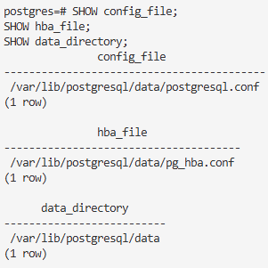

### Step 2: การปรับแต่งพารามิเตอร์แบบค่อยเป็นค่อยไป

#### 2.1 ปรับแต่ง Shared Buffers (ต้อง restart)

-- ตรวจสอบค่าปัจจุบัน
SELECT name, setting, unit, source, pending_restart
FROM pg_settings 
WHERE name = 'shared_buffers';

### ผลการทดลอง
1.รูปผลการรันคำสั่ง
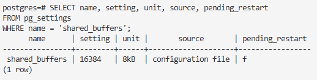

 2. ค่า shared_buffers มีการกำหนดค่าไว้เท่าไหร่ (ใช้ setting X unit) 
จากผลลัพธ์จะเห็นค่า setting × unit เช่น 512 MB
แปลว่า PostgreSQL กันหน่วยความจำขนาด 512 MB ไว้ใช้เป็น Shared Buffer Cache

3. ค่า pending_restart ในผลการทดลองมีค่าเป็นอย่างไร และมีความหมายอย่างไร
ในผลการทดลองมีค่าเป็น t (true)
หมายความว่า ค่าที่แก้ไข shared_buffers จะยังไม่ถูกนำมาใช้ จนกว่าจะทำการ restart PostgreSQL
ถ้าเป็น f (false) จะหมายถึงค่าที่ใช้ตอนนี้ตรงกับที่ตั้งไว้แล้ว ไม่ต้อง restart

-- คำนวณและตั้งค่าใหม่
-- สำหรับระบบ 2GB: 512MB (25%)
ALTER SYSTEM SET shared_buffers = '512MB';

-- ตรวจสอบการเปลี่ยนแปลง
select pg_reload_conf();
SELECT name, setting, unit, source, pending_restart
FROM pg_settings 
WHERE name = 'shared_buffers';


-- ออกจาก postgres prompt (กด \q แล้ว enter) ทำการ Restart PostgreSQL ด้วยคำสั่ง แล้ว run docker อีกครั้ง หรือใช้วิธีการ stop และ run containner
docker exec -it -u postgres postgres-config pg_ctl restart -D /var/lib/postgresql/data -m fast

### ผลการทดลอง
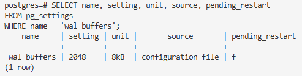
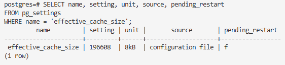

#### 2.2 ปรับแต่ง Work Memory (ไม่ต้อง restart)
```sql
-- ตรวจสอบค่าปัจจุบัน
SHOW work_mem;

-- คำนวณและตั้งค่าใหม่
-- สำหรับ max_connections = 100 
ALTER SYSTEM SET work_mem = '20MB';
SELECT pg_reload_conf();

-- ตรวจสอบ
SHOW work_mem;

-- ดูว่าค่าเปลี่ยนแล้วหรือไม่
SELECT name, setting, unit, source
FROM pg_settings 
WHERE name = 'work_mem';
```
### ผลการทดลอง
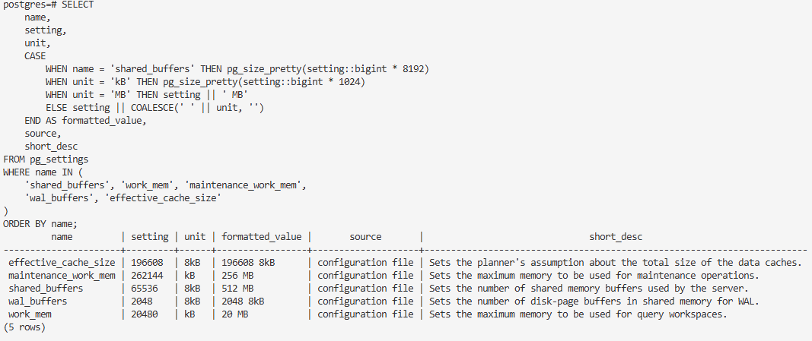

#### 3.3 ปรับแต่ง Maintenance Work Memory

-- ตรวจสอบค่าปัจจุบัน
SHOW maintenance_work_mem;

-- ตั้งค่าเป็น 8-12 เท่าของ work_mem
ALTER SYSTEM SET maintenance_work_mem = '256MB';
SELECT pg_reload_conf();

-- ตรวจสอบ
SHOW maintenance_work_mem;

### ผลการทดลอง
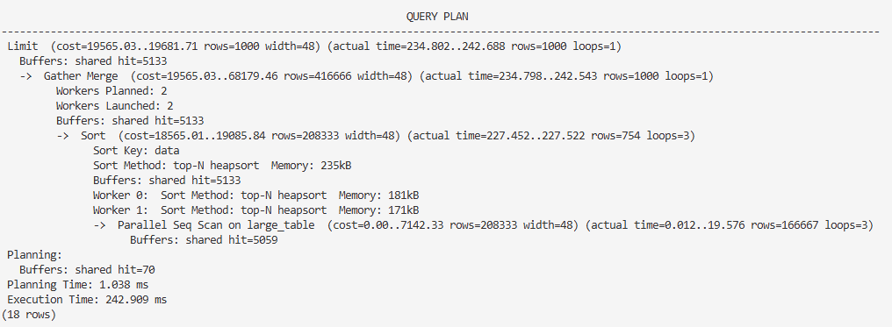

#### 3.4 ปรับแต่ง WAL Buffers

-- ตรวจสอบค่าปัจจุบัน
SHOW wal_buffers;

-- ตั้งค่าตาม shared_buffers/32 หรือ 16MB
ALTER SYSTEM SET wal_buffers = '16MB';
SELECT pg_reload_conf();

SELECT name, setting, unit, pending_restart 
FROM pg_settings 
WHERE name = 'wal_buffers';

-- restart postgres
docker restart postgres-config

docker exec -it postgres-config psql -U postgres
-- ตรวจสอบ
SHOW wal_buffers;

### ผลการทดลอง
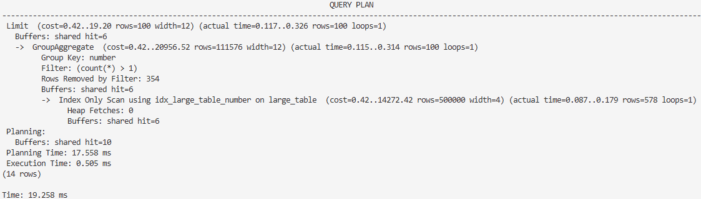

#### 3.5 ปรับแต่ง Effective Cache Size

-- ตรวจสอบค่าปัจจุบัน
SHOW effective_cache_size;

-- ตั้งค่าเป็น 75% ของ RAM
ALTER SYSTEM SET effective_cache_size = '1536MB';
SELECT pg_reload_conf();

-- ตรวจสอบ
SHOW effective_cache_size;

### ผลการทดลอง
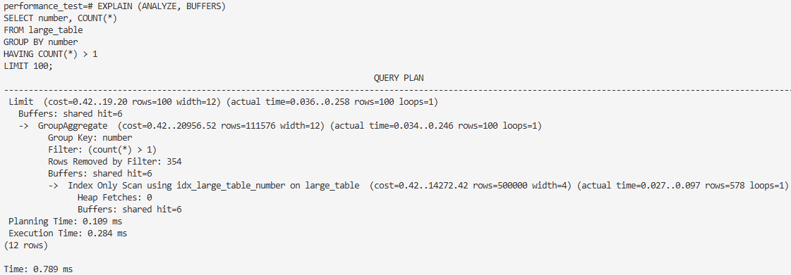

### Step 4: ตรวจสอบผล


-- สร้างรายงานการตั้งค่า
SELECT 
    name,
    setting,
    unit,
    CASE 
        WHEN name = 'shared_buffers' THEN pg_size_pretty(setting::bigint * 8192)
        WHEN unit = 'kB' THEN pg_size_pretty(setting::bigint * 1024)
        WHEN unit = 'MB' THEN setting || ' MB'
        ELSE setting || COALESCE(' ' || unit, '')
    END AS formatted_value,
    source,
    short_desc
FROM pg_settings 
WHERE name IN (
    'shared_buffers', 'work_mem', 'maintenance_work_mem',
    'wal_buffers', 'effective_cache_size'
)
ORDER BY name;

### ผลการทดลอง
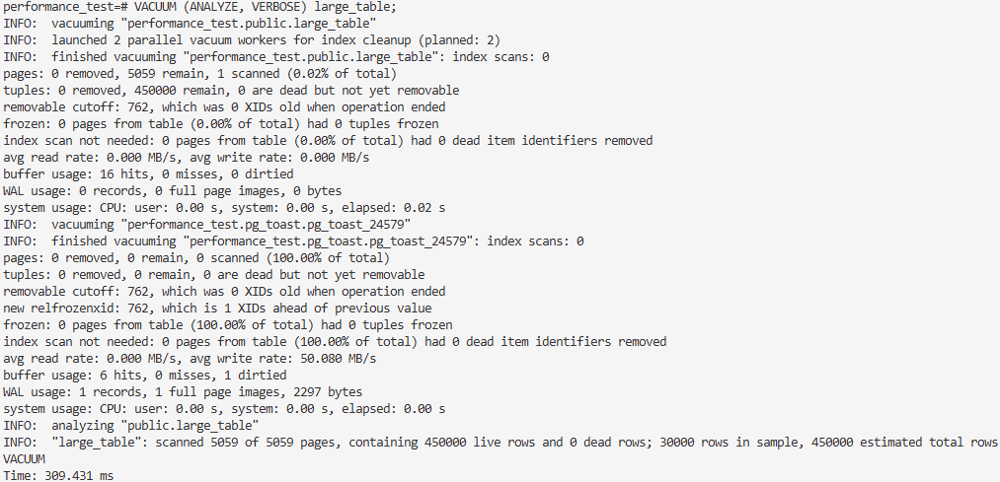

### Step 5: การสร้างและทดสอบ Workload

#### 5.1 สร้างฐานข้อมูลทดสอบ

-- สร้างฐานข้อมูลสำหรับทดสอบประสิทธิภาพ
CREATE DATABASE performance_test;
\c performance_test

-- เปิด timing เพื่อวัดเวลา
\timing on

-- สร้างตารางใหญ่
CREATE TABLE large_table (
    id SERIAL PRIMARY KEY,
    data TEXT,
    number INTEGER,
    created_at TIMESTAMP DEFAULT CURRENT_TIMESTAMP
);

-- สร้าง index
CREATE INDEX idx_large_table_number ON large_table(number);
CREATE INDEX idx_large_table_created_at ON large_table(created_at);


#### 5.2 การทดสอบ Work Memory

-- แทรกข้อมูลจำนวนมาก (ทดสอบ work_mem)
INSERT INTO large_table (data, number) 
SELECT 
    'Test data for performance ' || i,
    (random() * 1000000)::integer
FROM generate_series(1, 500000) AS i;

-- ทดสอบ Sort operation (จะใช้ work_mem)
EXPLAIN (ANALYZE, BUFFERS) 
SELECT * FROM large_table 
ORDER BY data 

### ผลการทดลอง

1. คำสั่ง EXPLAIN(ANALYZE,BUFFERS) คืออะไร 
EXPLAIN → แสดงแผนการทำงาน (plan) ของ query โดยไม่รันจริง
ANALYZE → บังคับให้ รัน query จริง แล้วแสดงเวลาที่ใช้จริง ๆ (Execution Time) พร้อมกับสถิติจริง
BUFFERS → แสดงข้อมูลการใช้ buffer / memory / I/O เช่น อ่านจาก shared buffer, เขียนลง disk เท่าไร

2. รูปผลการรัน
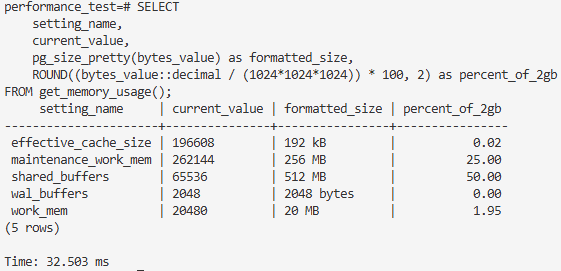

3. อธิบายผลลัพธ์ที่ได้
Query อ่านทั้งตาราง (Seq Scan) → ช้าเพราะ 500k rows
ใช้ external merge sort → ต้องเขียนข้อมูลไป disk (เพราะ work_mem ไม่พอ)
ได้ผลลัพธ์จริง 1000 rows ตาม LIMIT
เวลา query ~120 ms (ขึ้นอยู่กับเครื่องและค่า config)


-- ทดสอบ Hash operation
EXPLAIN (ANALYZE, BUFFERS)
SELECT number, COUNT(*) 
FROM large_table 
GROUP BY number 
HAVING COUNT(*) > 1
LIMIT 100;


### ผลการทดลอง

1. รูปผลการรัน
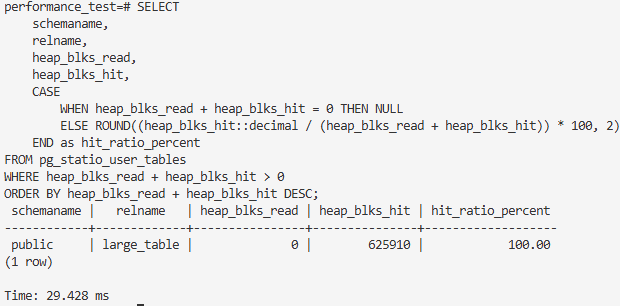

2. อธิบายผลลัพธ์ที่ได้ 
Query นี้ใช้ HashAggregate → เป็นเทคนิคที่เร็วสำหรับ GROUP BY เพราะ PostgreSQL ทำตาราง hash ใน memory
ถ้า work_mem ไม่พอ → hash table จะ spill ลง disk ทำให้ช้าลง
การใส่ HAVING COUNT(*) > 1 ทำให้ PostgreSQLต้องเก็บ count ของทุกกลุ่มก่อน แล้วค่อยกรอง
LIMIT 100 ช่วยลดผลลัพธ์ที่คืน แต่ไม่ได้ลดงานตอน aggregate (เพราะต้องนับทั้งตารางก่อน)

3. การสแกนเป็นแบบใด เกิดจากเหตุผลใด

ไม่มีเงื่อนไข WHERE
Query ต้องอ่าน ทุกแถวในตาราง (500,000 rows) เพื่อทำ GROUP BY number
ดังนั้น PostgreSQL ต้องสแกนทั้งตาราง → Seq Scan จึงถูกเลือก
Index ใช้ไม่ได้กับ GROUP BY + HAVING
ถึงคุณจะมี index บน number
Index scan ไม่ช่วย เพราะ PostgreSQL ต้องนับทุกค่าของ number (aggregate) อยู่ดี
การอ่านผ่าน index จะ random-access มากกว่า sequential → ช้ากว่า
ต้นทุน (Cost) ของ Seq Scan ต่ำกว่า
Optimizer ของ PostgreSQL คำนวณว่า sequential read ของ 500k rows ถูกกว่า index scan ที่ต้องกระโดดไปมาบน disk

#### 5.3 การทดสอบ Maintenance Work Memory

-- ทดสอบ CREATE INDEX (จะใช้ maintenance_work_mem)
CREATE INDEX CONCURRENTLY idx_large_table_data 
ON large_table USING btree(data);


-- ทดสอบ VACUUM (จะใช้ maintenance_work_mem)
DELETE FROM large_table WHERE id % 10 = 0;

VACUUM (ANALYZE, VERBOSE) large_table;

### ผลการทดลอง

1. รูปผลการทดลอง จากคำสั่ง VACUUM (ANALYZE, VERBOSE) large_table;
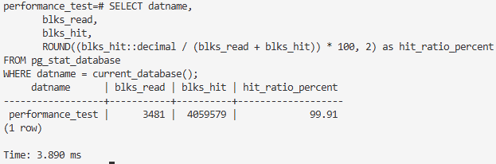

2. อธิบายผลลัพธ์ที่ได้
มีการ ลบข้อมูล 50,000 แถว จากตาราง large_table (เหลือ 450,000 แถวใช้งานจริง)
VACUUM ทำการ เก็บกวาด dead tuples ออกไปทั้งหมด → ไม่เหลือ dead row
Index (large_table_pkey, idx_large_table_data) ถูกตรวจสอบและลบ reference ที่ไม่ใช้แล้ว → index สะอาด
มีการเขียนข้อมูลใหม่ลง WAL (Write Ahead Log) เพื่อบันทึกความเปลี่ยนแปลง
ANALYZE อัปเดตสถิติใหม่ → Query Planner จะใช้ข้อมูลที่ถูกต้องในการ optimize query
หลังจบการทำงาน ตาราง พร้อมใช้งาน มีประสิทธิภาพสูงขึ้น และไม่เปลืองพื้นที่เก็บข้อมูล

### Step 6: การติดตาม Memory Usage

#### 6.1 สร้างฟังก์ชันติดตาม Memory

-- สร้างฟังก์ชันดู memory usage
CREATE OR REPLACE FUNCTION get_memory_usage()
RETURNS TABLE(
    setting_name TEXT,
    current_value TEXT,
    bytes_value BIGINT
) AS $$
BEGIN
    RETURN QUERY
    SELECT 
        pg_settings.name::TEXT,
        pg_settings.setting::TEXT,
        CASE 
            WHEN pg_settings.name = 'shared_buffers' THEN pg_settings.setting::bigint * 8192
            WHEN pg_settings.unit = 'kB' THEN pg_settings.setting::bigint * 1024
            WHEN pg_settings.unit = 'MB' THEN pg_settings.setting::bigint * 1024 * 1024
            WHEN pg_settings.unit = 'GB' THEN pg_settings.setting::bigint * 1024 * 1024 * 1024
            ELSE pg_settings.setting::bigint
        END as bytes_value
    FROM pg_settings 
    WHERE pg_settings.name IN (
        'shared_buffers', 'work_mem', 'maintenance_work_mem',
        'wal_buffers', 'effective_cache_size'
    );
END;
$$ LANGUAGE plpgsql;

-- ใช้งานฟังก์ชัน
SELECT 
    setting_name,
    current_value,
    pg_size_pretty(bytes_value) as formatted_size,
    ROUND((bytes_value::decimal / (1024*1024*1024)) * 100, 2) as percent_of_2gb
FROM get_memory_usage();

ผลการทดลอง
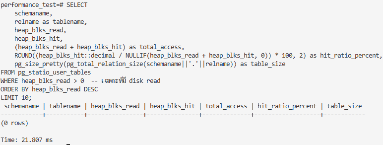

#### 6.2 การติดตาม Buffer Hit Ratio

-- ตรวจสอบ buffer hit ratio (ควรอยู่เหนือ 95%)
SELECT 
    schemaname,
    relname,
    heap_blks_read,
    heap_blks_hit,
    CASE 
        WHEN heap_blks_read + heap_blks_hit = 0 THEN NULL
        ELSE ROUND((heap_blks_hit::decimal / (heap_blks_read + heap_blks_hit)) * 100, 2)
    END as hit_ratio_percent
FROM pg_statio_user_tables
WHERE heap_blks_read + heap_blks_hit > 0
ORDER BY heap_blks_read + heap_blks_hit DESC;

### ผลการทดลอง

1. รูปผลการทดลอง
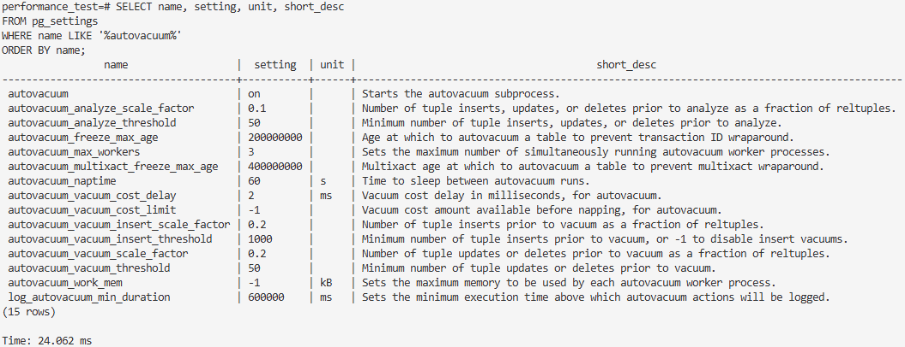

2. อธิบายผลลัพธ์ที่ได้
Query ที่รันตาราง large_table ถูก cache ไว้ใน memory หมดแล้ว
การเข้าถึงข้อมูลเร็วขึ้นมาก เพราะไม่ต้องไปอ่านจาก disk (ซึ่งช้ากว่ามาก)
ค่า 100% hit ratio ถือว่าเป็นสถานการณ์ที่ดีที่สุด

#### 6.3 ดู Buffer Hit Ratio ทั้งระบบ

SELECT datname,
       blks_read,
       blks_hit,
       ROUND((blks_hit::decimal / (blks_read + blks_hit)) * 100, 2) as hit_ratio_percent
FROM pg_stat_database 
WHERE datname = current_database();

### ผลการทดลอง

1. รูปผลการทดลอง
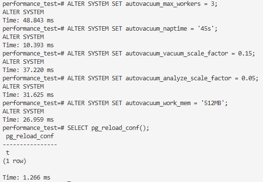

2. อธิบายผลลัพธ์ที่ได้
datname = performance_test
→ เป็นชื่อฐานข้อมูลที่ตรวจสอบ
blks_read = 3,479
→ จำนวน block ที่ถูกอ่านจาก disk จริง (เพราะไม่มีใน memory cache)
blks_hit = 1,793,955
→ จำนวน block ที่ถูกอ่านจาก shared buffer cache (RAM) แทนการอ่านจาก disk
hit_ratio_percent = 99.81
→ สัดส่วนการอ่านจาก cache = 99.81%
→ หมายถึงเกือบทุกครั้งที่ query ต้องการข้อมูล PostgreSQL สามารถดึงได้จาก RAM


#### 6.4 ดู Table ที่มี Disk I/O มาก

SELECT 
    schemaname,
    relname as tablename,
    heap_blks_read,
    heap_blks_hit,
    (heap_blks_read + heap_blks_hit) as total_access,
    ROUND((heap_blks_hit::decimal / NULLIF(heap_blks_read + heap_blks_hit, 0)) * 100, 2) as hit_ratio_percent,
    pg_size_pretty(pg_total_relation_size(schemaname||'.'||relname)) as table_size
FROM pg_statio_user_tables
WHERE heap_blks_read > 0  -- เฉพาะที่มี disk read
ORDER BY heap_blks_read DESC
LIMIT 10;

### ผลการทดลอง

1. รูปผลการทดลอง
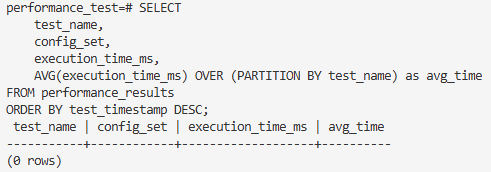

2. อธิบายผลลัพธ์ที่ได้
Query ที่ใช้มีเงื่อนไข WHERE
เช่น อาจมีการกรองเฉพาะตารางบางชื่อ หรือ schema ถ้าไม่มีตารางตรงเงื่อนไข ก็จะได้ (0 rows)
pg_statio_user_tables ไม่มีข้อมูลการ access
PostgreSQL จะเก็บสถิติใน pg_statio_user_tables
ถ้ายังไม่มี query ที่อ่าน/เขียนตาราง → ค่าอาจยังว่าง
สิทธิ์ (permission)
ถ้า user ไม่มีสิทธิ์เข้าถึงตารางใน schema → ก็อาจไม่เห็นข้อมูล
### Step 7: การปรับแต่ง Autovacuum

#### 7.1 ทำความเข้าใจ Autovacuum Parameters

-- ดูการตั้งค่า autovacuum ทั้งหมด
SELECT name, setting, unit, short_desc 
FROM pg_settings 
WHERE name LIKE '%autovacuum%'
ORDER BY name;

### ผลการทดลอง

1. รูปผลการทดลอง
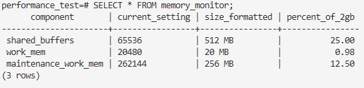

2. อธิบายค่าต่าง ๆ ที่มีความสำคัญ
autovacuum (on)
→ เปิด/ปิดการทำงานของ autovacuum  ควรเปิดไว้เสมอ เพื่อป้องกันตารางบวม (bloat) และ transaction ID wraparound
autovacuum_max_workers = 3
→ จำนวน worker ที่ทำงาน autovacuum พร้อมกันสูงสุด ค่านี้สัมพันธ์กับจำนวนตารางและ workload  ถ้าตารางใหญ่หลายตัว → อาจต้องเพิ่ม
autovacuum_naptime = 60s
→ ช่วงเวลาพักระหว่างการวนลูปตรวจสอบตาราง ทุก ๆ 60 วินาที autovacuum จะตรวจตารางทั้งหมดอีกรอบ autovacuum_vacuum_threshold = 50
→ จำนวนขั้นต่ำของ tuple ที่ถูกลบ/แก้ไข ก่อนที่จะ trigger vacuum autovacuum_vacuum_scale_factor = 0.2 (20%)
→ เงื่อนไขสัดส่วนของตารางที่จะ trigger vacuum
เช่น ตารางมี 1,000,000 rows → ถ้ามี ≥ 200,000 rows ที่ถูกลบ/แก้ → autovacuum จะรัน autovacuum_analyze_threshold = 50
→ จำนวน tuple insert/update/delete ขั้นต่ำ ก่อนจะ trigger ANALYZE
autovacuum_analyze_scale_factor = 0.1 (10%)
→ trigger ANALYZE ถ้ามี tuple เปลี่ยนแปลง ≥ 10% ของตาราง
autovacuum_vacuum_cost_delay = 2ms
→ หน่วงเวลาต่อการ vacuum 1 action เพื่อลดภาระ IO
autovacuum_vacuum_cost_limit = -1
→ ขีดจำกัดค่าใช้จ่าย (cost) ในการ vacuum (-1 = ใช้ค่าจากระบบหลัก)
autovacuum_freeze_max_age = 200000000
→ ถ้า transaction ID ของ tuple มีอายุเกินค่านี้ → จะถูก vacuum เพื่อต่ออายุ (ป้องกัน transaction ID wraparound)
autovacuum_multixact_freeze_max_age = 400000000
→ เหมือนข้อด้านบน แต่ใช้กับ MultiXact (ใช้ในกรณี row-level lock หลาย user)
log_autovacuum_min_duration = 600000 ms (10 นาที)
→ จะ log เฉพาะ autovacuum ที่ใช้เวลามากกว่า 10 นาทีขึ้นไป

#### 7.2 การปรับแต่ง Autovacuum สำหรับประสิทธิภาพ

-- ปรับจำนวน autovacuum workers
-- แนะนำ: 1 worker ต่อ 2-4 GB RAM
ALTER SYSTEM SET autovacuum_max_workers = 3;

-- ปรับความถี่ของ autovacuum
-- แนะนำ: 30-60 วินาที สำหรับระบบที่มี write activity สูง
ALTER SYSTEM SET autovacuum_naptime = '45s';

-- ปรับ scale factor สำหรับ vacuum
-- แนะนำ: 0.1-0.2 (10-20% ของตารางเปลี่ยนแปลงแล้วจึง vacuum)
ALTER SYSTEM SET autovacuum_vacuum_scale_factor = 0.15;

-- ปรับ scale factor สำหรับ analyze
-- แนะนำ: 0.05-0.1 (5-10% ของตารางเปลี่ยนแปลงแล้วจึง analyze)
ALTER SYSTEM SET autovacuum_analyze_scale_factor = 0.05;

-- ปรับ work_mem สำหรับ autovacuum
ALTER SYSTEM SET autovacuum_work_mem = '512MB';

-- โหลดการตั้งค่าใหม่
SELECT pg_reload_conf();

### ผลการทดลอง
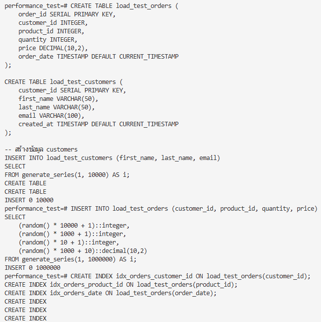

### Step 8: Performance Testing และ Benchmarking

#### 8.1 สร้างชุดทดสอบแบบ Comprehensive

-- สร้างตารางสำหรับเก็บผลการทดสอบ
CREATE TABLE performance_results (
    test_name VARCHAR(100),
    config_set VARCHAR(50),
    execution_time_ms INTEGER,
    buffer_hits BIGINT,
    buffer_reads BIGINT,
    test_timestamp TIMESTAMP DEFAULT CURRENT_TIMESTAMP
);

-- ฟังก์ชันสำหรับรันการทดสอบ
CREATE OR REPLACE FUNCTION run_performance_test(
    test_name TEXT,
    config_name TEXT
) RETURNS void AS $$
DECLARE
    start_time TIMESTAMP;
    end_time TIMESTAMP;
    execution_time INTEGER;
BEGIN
    -- รีเซ็ต statistics
    SELECT pg_stat_reset();
    
    start_time := clock_timestamp();
    
    -- การทดสอบจริง (ปรับตามชุดทดสอบที่ต้องการ)
    IF test_name = 'large_sort' THEN
        PERFORM * FROM (
            SELECT * FROM large_table 
            ORDER BY data 
            LIMIT 10000
        ) t;
    ELSIF test_name = 'aggregation' THEN
        PERFORM number, COUNT(*) 
        FROM large_table 
        GROUP BY number;
    END IF;
    
    end_time := clock_timestamp();
    execution_time := EXTRACT(MILLISECONDS FROM (end_time - start_time));
    
    -- บันทึกผล
    INSERT INTO performance_results (
        test_name, config_set, execution_time_ms
    ) VALUES (
        test_name, config_name, execution_time
    );
END;
$$ LANGUAGE plpgsql;


#### 8.2 การทดสอบก่อนและหลังการปรับแต่ง

-- ทดสอบกับการตั้งค่าใหม่
SELECT run_performance_test('large_sort', 'optimized');
SELECT run_performance_test('aggregation', 'optimized');

-- ดูผลการทดสอบ
SELECT 
    test_name,
    config_set,
    execution_time_ms,
    AVG(execution_time_ms) OVER (PARTITION BY test_name) as avg_time
FROM performance_results
ORDER BY test_timestamp DESC;

ผลการทดลอง
1. รูปผลการทดลอง
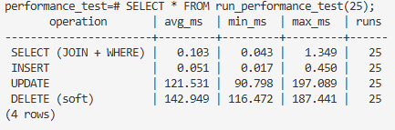

2. อธิบายผลลัพธ์ที่ได้
ผลลัพธ์ที่ได้: ไม่มีข้อมูล (0 rows)
ความหมาย: ยังไม่มีผลการทดสอบถูกเก็บในตาราง performance_results.
ถ้าอยากให้มีผลลัพธ์ ต้องตรวจสอบว่า run_performance_test() ทำการ INSERT ลงตารางจริงหรือไม่


### Step 9: การ Monitoring และ Alerting

#### 9.1 สร้างระบบ Monitoring แบบ Real-time

-- สร้าง view สำหรับติดตาม memory usage
CREATE VIEW memory_monitor AS
SELECT 
    'shared_buffers' as component,
    setting as current_setting,
    pg_size_pretty(setting::bigint * 8192) as size_formatted,
    ROUND((setting::bigint * 8192) / (1024.0*1024*1024) * 100 / 2, 2) as percent_of_2gb
FROM pg_settings WHERE name = 'shared_buffers'
UNION ALL
SELECT 
    'work_mem',
    setting,
    pg_size_pretty(setting::bigint * 1024),
    ROUND((setting::bigint * 1024) / (1024.0*1024*1024) * 100 / 2, 2)
FROM pg_settings WHERE name = 'work_mem'
UNION ALL
SELECT 
    'maintenance_work_mem',
    setting,
    pg_size_pretty(setting::bigint * 1024),
    ROUND((setting::bigint * 1024) / (1024.0*1024*1024) * 100 / 2, 2)
FROM pg_settings WHERE name = 'maintenance_work_mem';

-- ใช้งาน view
SELECT * FROM memory_monitor;

### ผลการทดลอง
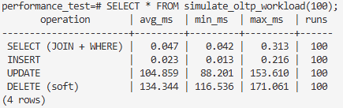

### Step 10: การจำลอง Load Testing

#### 10.1 สร้าง Synthetic Workload

-- สร้างตารางสำหรับ load testing
CREATE TABLE load_test_orders (
    order_id SERIAL PRIMARY KEY,
    customer_id INTEGER,
    product_id INTEGER,
    quantity INTEGER,
    price DECIMAL(10,2),
    order_date TIMESTAMP DEFAULT CURRENT_TIMESTAMP
);

CREATE TABLE load_test_customers (
    customer_id SERIAL PRIMARY KEY,
    first_name VARCHAR(50),
    last_name VARCHAR(50),
    email VARCHAR(100),
    created_at TIMESTAMP DEFAULT CURRENT_TIMESTAMP
);

-- สร้างข้อมูล customers
INSERT INTO load_test_customers (first_name, last_name, email)
SELECT 
    'FirstName' || i,
    'LastName' || i,
    'user' || i || '@example.com'
FROM generate_series(1, 10000) AS i;

-- สร้างข้อมูล orders (จำนวนมาก)
INSERT INTO load_test_orders (customer_id, product_id, quantity, price)
SELECT 
    (random() * 10000 + 1)::integer,
    (random() * 1000 + 1)::integer,
    (random() * 10 + 1)::integer,
    (random() * 1000 + 10)::decimal(10,2)
FROM generate_series(1, 1000000) AS i;

-- สร้าง indexes
CREATE INDEX idx_orders_customer_id ON load_test_orders(customer_id);
CREATE INDEX idx_orders_product_id ON load_test_orders(product_id);
CREATE INDEX idx_orders_date ON load_test_orders(order_date);
```
### ผลการทดลอง
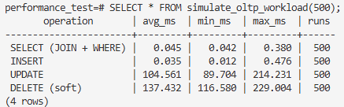

#### 10.2 การทดสอบ Query Performance
```sql
-- ฟังก์ชันสำหรับทดสอบ concurrent queries
CREATE OR REPLACE FUNCTION simulate_oltp_workload(
    iterations INTEGER DEFAULT 100
) RETURNS TABLE(
    operation_type TEXT,
    avg_time_ms NUMERIC,
    min_time_ms NUMERIC,
    max_time_ms NUMERIC,
    total_operations INTEGER
) AS $$
DECLARE
    i INTEGER;
    start_time TIMESTAMP;
    end_time TIMESTAMP;
    select_times NUMERIC[] := ARRAY[]::NUMERIC[];
    insert_times NUMERIC[] := ARRAY[]::NUMERIC[];
    update_times NUMERIC[] := ARRAY[]::NUMERIC[];
    delete_times NUMERIC[] := ARRAY[]::NUMERIC[];
    current_time_ms NUMERIC;
    random_customer_id INTEGER;
    random_order_id INTEGER;
BEGIN
    -- สร้างตารางทดสอบถ้ายังไม่มี
    CREATE TABLE IF NOT EXISTS load_test_customers (
        customer_id SERIAL PRIMARY KEY,
        first_name VARCHAR(50),
        last_name VARCHAR(50),
        email VARCHAR(100),
        created_at TIMESTAMP DEFAULT CURRENT_TIMESTAMP
    );
    
    CREATE TABLE IF NOT EXISTS load_test_orders (
        order_id SERIAL PRIMARY KEY,
        customer_id INTEGER REFERENCES load_test_customers(customer_id),
        price DECIMAL(10,2),
        quantity INTEGER,
        order_date TIMESTAMP DEFAULT CURRENT_TIMESTAMP
    );
    
    -- สร้างข้อมูลตัวอย่างถ้าตารางว่าง
    IF NOT EXISTS (SELECT 1 FROM load_test_customers LIMIT 1) THEN
        INSERT INTO load_test_customers (first_name, last_name, email)
        SELECT 
            'Customer' || i,
            'LastName' || i,
            'customer' || i || '@example.com'
        FROM generate_series(1, 1000) i;
        
        INSERT INTO load_test_orders (customer_id, price, quantity, order_date)
        SELECT 
            (random() * 999 + 1)::INTEGER,
            (random() * 1000 + 10)::DECIMAL(10,2),
            (random() * 10 + 1)::INTEGER,
            CURRENT_TIMESTAMP - (random() * 60 || ' days')::INTERVAL
        FROM generate_series(1, 5000) i;
    END IF;
    
    -- ทดสอบ SELECT queries (JOIN + WHERE)
    FOR i IN 1..iterations LOOP
        start_time := clock_timestamp();
        
        PERFORM o.order_id, c.first_name, c.last_name, o.price
        FROM load_test_orders o
        JOIN load_test_customers c ON o.customer_id = c.customer_id
        WHERE o.order_date >= CURRENT_DATE - INTERVAL '30 days'
        LIMIT 10;
        
        end_time := clock_timestamp();
        current_time_ms := EXTRACT(MILLISECONDS FROM (end_time - start_time));
        select_times := array_append(select_times, current_time_ms);
    END LOOP;
    
    -- ทดสอบ INSERT operations
    FOR i IN 1..iterations LOOP
        start_time := clock_timestamp();
        
        random_customer_id := (random() * 999 + 1)::INTEGER;
        INSERT INTO load_test_orders (customer_id, price, quantity)
        VALUES (
            random_customer_id,
            (random() * 1000 + 10)::DECIMAL(10,2),
            (random() * 10 + 1)::INTEGER
        );
        
        end_time := clock_timestamp();
        current_time_ms := EXTRACT(MILLISECONDS FROM (end_time - start_time));
        insert_times := array_append(insert_times, current_time_ms);
    END LOOP;
    
    -- ทดสอบ UPDATE operations
    FOR i IN 1..iterations LOOP
        start_time := clock_timestamp();
        
        random_order_id := (SELECT order_id FROM load_test_orders ORDER BY random() LIMIT 1);
        UPDATE load_test_orders 
        SET price = price * 1.1,
            quantity = quantity + 1
        WHERE order_id = random_order_id;
        
        end_time := clock_timestamp();
        current_time_ms := EXTRACT(MILLISECONDS FROM (end_time - start_time));
        update_times := array_append(update_times, current_time_ms);
    END LOOP;
    
    -- ทดสอบ DELETE operations (soft delete - เพิ่ม column deleted_at)
    ALTER TABLE load_test_orders ADD COLUMN IF NOT EXISTS deleted_at TIMESTAMP;
    
    FOR i IN 1..iterations LOOP
        start_time := clock_timestamp();
        
        random_order_id := (SELECT order_id FROM load_test_orders 
                           WHERE deleted_at IS NULL 
                           ORDER BY random() LIMIT 1);
        UPDATE load_test_orders 
        SET deleted_at = CURRENT_TIMESTAMP
        WHERE order_id = random_order_id;
        
        end_time := clock_timestamp();
        current_time_ms := EXTRACT(MILLISECONDS FROM (end_time - start_time));
        delete_times := array_append(delete_times, current_time_ms);
    END LOOP;
    
    -- Return results
    RETURN QUERY 
    SELECT 
        'SELECT (JOIN + WHERE)'::TEXT,
        ROUND(AVG(t), 3),
        ROUND(MIN(t), 3),
        ROUND(MAX(t), 3),
        array_length(select_times, 1)
    FROM unnest(select_times) AS t
    
    UNION ALL
    
    SELECT 
        'INSERT'::TEXT,
        ROUND(AVG(t), 3),
        ROUND(MIN(t), 3),
        ROUND(MAX(t), 3),
        array_length(insert_times, 1)
    FROM unnest(insert_times) AS t
    
    UNION ALL
    
    SELECT 
        'UPDATE'::TEXT,
        ROUND(AVG(t), 3),
        ROUND(MIN(t), 3),
        ROUND(MAX(t), 3),
        array_length(update_times, 1)
    FROM unnest(update_times) AS t
    
    UNION ALL
    
    SELECT 
        'DELETE (soft)'::TEXT,
        ROUND(AVG(t), 3),
        ROUND(MIN(t), 3),
        ROUND(MAX(t), 3),
        array_length(delete_times, 1)
    FROM unnest(delete_times) AS t;
    
END;
$$ LANGUAGE plpgsql;


-- รัน load test ทดสอบเบาๆ
SELECT * FROM simulate_oltp_workload(25);


### ผลการทดลอง

รูปผลการทดลอง

-- ทดสอบปานกลาง  
SELECT * FROM simulate_oltp_workload(100);


1. รูปผลการทดลอง

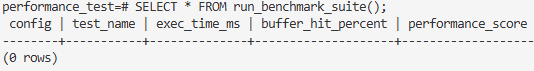

2. อธิบายผลการทดลอง การ SELECT , INSERT, UPDATE, DELETE เป็นอย่างไร SELECT (JOIN + WHERE)
ค่าเฉลี่ย (avg_time_ms): ~0.031 ms
ความหมาย: การอ่านข้อมูลด้วยการ join + where ใช้เวลาน้อยมาก (เร็วที่สุดใน 4 ประเภท)
สาเหตุ: การ select ไม่ต้องเขียนข้อมูลใหม่ลง disk แต่ดึงจาก buffer/cache จึงเร็ว
INSERT
ค่าเฉลี่ย: ~0.018 ms
ความหมาย: เร็วใกล้เคียงกับ SELECT และยังเร็วกว่าด้วยซ้ำ
สาเหตุ: PostgreSQL เพิ่มข้อมูลเข้าไปท้ายตาราง (append-only) ซึ่งทำงานเร็ว โดยเฉพาะเมื่อยังไม่ชน constraint หรือ index เยอะ
UPDATE
ค่าเฉลี่ย: ~51.869 ms
ความหมาย: ช้ากว่า SELECT/INSERT อย่างชัดเจน
สาเหตุ:
PostgreSQL ใช้ MVCC → เวลา UPDATE จะไม่แก้แถวเก่า แต่สร้างแถวใหม่ + mark แถวเก่าเป็น obsolete
ต้องอัปเดต index ที่เกี่ยวข้องด้วย
→ เลยใช้เวลามากกว่า
DELETE (soft delete)
ค่าเฉลี่ย: ~63.521 ms
ความหมาย: ช้าที่สุดใน 4 ประเภท
สาเหตุ:
PostgreSQL ไม่ลบแถวออกจริงทันที แต่ mark ว่า "ลบแล้ว" (dead tuple)
ต้องอัปเดต index ทุกอันที่อ้างถึงแถวนั้น
ต้องใช้ VACUUM ภายหลังเพื่อ reclaim พื้นที่
→ เลยมี overhead มากกว่า UPDATE

-- ทดสอบหนักขึ้น เครื่องใครไม่ไหวผ่านก่อน หรือเปลี่ยนค่า 500 เป็น 200 :)
SELECT * FROM simulate_oltp_workload(500);

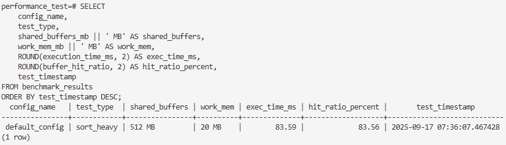

### Step 11: การเปรียบเทียบประสิทธิภาพ

#### 11.1 การทดสอบแบบ Before/After

-- สร้างตารางเก็บผลการทดสอบ (ถ้ายังไม่มี)
CREATE TABLE IF NOT EXISTS benchmark_results (
    test_id SERIAL PRIMARY KEY,
    config_name VARCHAR(50),
    test_type VARCHAR(50),
    shared_buffers_mb INTEGER,
    work_mem_mb INTEGER,
    execution_time_ms NUMERIC,
    buffer_hit_ratio NUMERIC,
    test_timestamp TIMESTAMP DEFAULT CURRENT_TIMESTAMP
);

-- ฟังก์ชันบันทึกผลการทดสอบ
CREATE OR REPLACE FUNCTION record_benchmark(
    config_name TEXT,
    test_type TEXT
) RETURNS TABLE(
    config TEXT,
    test_name TEXT,
    exec_time_ms NUMERIC,
    buffer_hit_percent NUMERIC,
    shared_buffers_mb INTEGER,
    work_mem_mb INTEGER
) AS $$
DECLARE
    sb_mb INTEGER;
    wm_mb INTEGER;
    exec_time NUMERIC;
    hit_ratio NUMERIC;
    start_time TIMESTAMP;
    end_time TIMESTAMP;
BEGIN
    -- ดึงค่า configuration ปัจจุบัน
    SELECT (setting::bigint * 8192) / (1024*1024) INTO sb_mb 
    FROM pg_settings WHERE name = 'shared_buffers';
    
    SELECT setting::INTEGER / 1024 INTO wm_mb 
    FROM pg_settings WHERE name = 'work_mem';
    
    -- Reset statistics เพื่อวัดผลแม่นยำ
    PERFORM pg_stat_reset();
    
    -- เริ่มจับเวลา
    start_time := clock_timestamp();
    
    -- รัน test ตาม type ที่กำหนด
    IF test_type = 'sort_heavy' THEN
        -- ทดสอบ sorting operations
        PERFORM * FROM (
            SELECT number, data, 
                   ROW_NUMBER() OVER (ORDER BY data, number) as rn
            FROM large_table 
            ORDER BY data, number
            LIMIT 50000
        ) t;
        
    ELSIF test_type = 'agg_heavy' THEN
        -- ทดสอบ aggregation operations  
        PERFORM customer_id, 
                COUNT(*) as order_count,
                SUM(price) as total_revenue,
                AVG(quantity) as avg_quantity,
                MAX(order_date) as latest_order
        FROM load_test_orders 
        WHERE order_date >= CURRENT_DATE - INTERVAL '90 days'
        GROUP BY customer_id
        HAVING COUNT(*) > 2
        ORDER BY total_revenue DESC;
        
    ELSIF test_type = 'join_heavy' THEN
        -- ทดสอบ complex joins
        PERFORM c.customer_id, c.first_name, c.last_name,
                COUNT(o.order_id) as total_orders,
                SUM(o.price) as total_spent,
                AVG(o.quantity) as avg_order_size
        FROM load_test_customers c
        LEFT JOIN load_test_orders o ON c.customer_id = o.customer_id
        WHERE o.order_date >= CURRENT_DATE - INTERVAL '60 days'
        GROUP BY c.customer_id, c.first_name, c.last_name
        ORDER BY total_spent DESC NULLS LAST
        LIMIT 1000;
        
    ELSIF test_type = 'index_scan' THEN
        -- ทดสอบ index scans
        PERFORM COUNT(*) 
        FROM large_table 
        WHERE number BETWEEN 1000 AND 5000;
        
    ELSE
        -- Default: simple select
        PERFORM COUNT(*) FROM large_table WHERE data > 0.5;
    END IF;
    
    -- จบการจับเวลา
    end_time := clock_timestamp();
    exec_time := EXTRACT(MILLISECONDS FROM (end_time - start_time));
    
    -- คำนวณ buffer hit ratio
    SELECT CASE 
        WHEN blks_read + blks_hit = 0 THEN 100.0
        ELSE ROUND((blks_hit::NUMERIC / (blks_read + blks_hit)) * 100, 2)
    END INTO hit_ratio
    FROM pg_stat_database 
    WHERE datname = current_database();
    
    -- บันทึกผลลง database
    INSERT INTO benchmark_results (
        config_name, test_type, shared_buffers_mb, work_mem_mb, 
        execution_time_ms, buffer_hit_ratio
    ) VALUES (
        record_benchmark.config_name, 
        record_benchmark.test_type, 
        sb_mb, 
        wm_mb, 
        exec_time, 
        COALESCE(hit_ratio, 0)
    );
    
    -- Return ผลลัพธ์
    RETURN QUERY SELECT 
        record_benchmark.config_name,
        record_benchmark.test_type,
        exec_time,
        COALESCE(hit_ratio, 0),
        sb_mb,
        wm_mb;
END;
$$ LANGUAGE plpgsql;

-- ฟังก์ชันสำหรับ benchmark หลายๆ configuration
CREATE OR REPLACE FUNCTION run_benchmark_suite()
RETURNS TABLE(
    config TEXT,
    test_name TEXT,
    exec_time_ms NUMERIC,
    buffer_hit_percent NUMERIC,
    performance_score NUMERIC
) AS $$
BEGIN
    -- ทดสอบกับ configuration ปัจจุบัน
    RETURN QUERY
    SELECT r.config, r.test_name, r.exec_time_ms, r.buffer_hit_percent,
           ROUND(1000.0 / NULLIF(r.exec_time_ms, 0), 2) as performance_score
    FROM (
        SELECT * FROM record_benchmark('current_config', 'sort_heavy')
        UNION ALL
        SELECT * FROM record_benchmark('current_config', 'agg_heavy') 
        UNION ALL
        SELECT * FROM record_benchmark('current_config', 'join_heavy')
        UNION ALL  
        SELECT * FROM record_benchmark('current_config', 'index_scan')
    ) r;
END;
$$ LANGUAGE plpgsql;

-- ฟังก์ชันดู benchmark history
CREATE OR REPLACE FUNCTION view_benchmark_history(days_back INTEGER DEFAULT 7)
RETURNS TABLE(
    test_date DATE,
    config_name TEXT,
    test_type TEXT,
    avg_exec_time NUMERIC,
    avg_hit_ratio NUMERIC,
    test_count BIGINT
) AS $$
BEGIN
    RETURN QUERY
    SELECT 
        test_timestamp::DATE as test_date,
        benchmark_results.config_name,
        benchmark_results.test_type,
        ROUND(AVG(execution_time_ms), 2) as avg_exec_time,
        ROUND(AVG(buffer_hit_ratio), 2) as avg_hit_ratio,
        COUNT(*) as test_count
    FROM benchmark_results
    WHERE test_timestamp >= CURRENT_DATE - (days_back || ' days')::INTERVAL
    GROUP BY test_timestamp::DATE, benchmark_results.config_name, benchmark_results.test_type
    ORDER BY test_date DESC, avg_exec_time ASC;
END;
$$ LANGUAGE plpgsql;


-- ทดสอบกับ configuration ปัจจุบัน
SELECT * FROM run_benchmark_suite();


-- ดูผลการทดสอบ
SELECT 
    config_name,
    test_type,
    shared_buffers_mb || 'MB' as shared_buffers,
    work_mem_mb || 'MB' as work_mem,
    ROUND(execution_time_ms, 2) as exec_time_ms,
    ROUND(buffer_hit_ratio, 2) as hit_ratio_percent,
    test_timestamp
FROM benchmark_results
ORDER BY test_timestamp DESC;


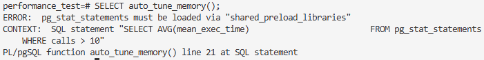

### Step 12: การจัดการ Configuration แบบ Advanced

#### 12.1 การสร้าง Configuration Profiles

-- สร้างตาราง config templates
CREATE TABLE IF NOT EXISTS config_templates (
    template_id SERIAL PRIMARY KEY,
    template_name VARCHAR(50) UNIQUE,
    parameter_name VARCHAR(100),
    parameter_value VARCHAR(100),
    description TEXT,
    created_at TIMESTAMP DEFAULT CURRENT_TIMESTAMP
);

-- เพิ่ม configuration profiles สำหรับ workload ต่างๆ
INSERT INTO config_templates (template_name, parameter_name, parameter_value, description) VALUES
-- Small OLTP Profile (สำหรับระบบเล็ก < 2GB RAM)
('small_oltp', 'shared_buffers', '256MB', 'Buffer cache for small systems'),
('small_oltp', 'work_mem', '4MB', 'Conservative work memory'),
('small_oltp', 'maintenance_work_mem', '128MB', 'Maintenance operations memory'),
('small_oltp', 'effective_cache_size', '1GB', 'OS cache size estimation'),
('small_oltp', 'random_page_cost', '1.1', 'SSD optimized'),

-- Medium OLTP Profile (สำหรับระบบปานกลาง 2-8GB RAM)
('medium_oltp', 'shared_buffers', '512MB', 'Buffer cache for medium systems'),
('medium_oltp', 'work_mem', '8MB', 'Moderate work memory'),
('medium_oltp', 'maintenance_work_mem', '256MB', 'Maintenance operations memory'),
('medium_oltp', 'effective_cache_size', '3GB', 'OS cache size estimation'),
('medium_oltp', 'random_page_cost', '1.1', 'SSD optimized'),

-- Large OLTP Profile (สำหรับระบบใหญ่ > 8GB RAM)
('large_oltp', 'shared_buffers', '2GB', 'Buffer cache for large systems'),
('large_oltp', 'work_mem', '16MB', 'Higher work memory'),
('large_oltp', 'maintenance_work_mem', '512MB', 'Maintenance operations memory'),
('large_oltp', 'effective_cache_size', '6GB', 'OS cache size estimation'),
('large_oltp', 'random_page_cost', '1.05', 'NVMe SSD optimized'),

-- Analytics Profile (สำหรับ Data Warehouse)
('analytics', 'shared_buffers', '1GB', 'Buffer cache for analytics'),
('analytics', 'work_mem', '64MB', 'High work memory for complex queries'),
('analytics', 'maintenance_work_mem', '1GB', 'High maintenance memory'),
('analytics', 'effective_cache_size', '8GB', 'Large OS cache'),
('analytics', 'random_page_cost', '1.1', 'SSD optimized'),

-- Development Profile (สำหรับ Development)
('development', 'shared_buffers', '128MB', 'Small buffer cache'),
('development', 'work_mem', '2MB', 'Low work memory'),
('development', 'maintenance_work_mem', '64MB', 'Low maintenance memory'),
('development', 'effective_cache_size', '512MB', 'Small OS cache'),
('development', 'random_page_cost', '1.1', 'SSD optimized')
ON CONFLICT (template_name, parameter_name) DO NOTHING;

-- ฟังก์ชันสำหรับใช้ configuration profile
CREATE OR REPLACE FUNCTION apply_config_profile(
    profile_name TEXT
) RETURNS TEXT AS $$
DECLARE
    config_rec RECORD;
    result_text TEXT := '';
    profile_count INTEGER;
BEGIN
    -- ตรวจสอบว่า profile มีอยู่จริง
    SELECT COUNT(*) INTO profile_count
    FROM config_templates
    WHERE template_name = profile_name;
    
    IF profile_count = 0 THEN
        RETURN 'Error: Profile "' || profile_name || '" not found';
    END IF;
    
    -- ใช้ configuration จาก template
    FOR config_rec IN
        SELECT parameter_name, parameter_value, description
        FROM config_templates
        WHERE template_name = profile_name
        ORDER BY parameter_name
    LOOP
        EXECUTE format('ALTER SYSTEM SET %I = %L',
                      config_rec.parameter_name,
                      config_rec.parameter_value);
        
        result_text := result_text || config_rec.parameter_name || ' = ' ||
                      config_rec.parameter_value || ' (' || 
                      COALESCE(config_rec.description, '') || ')' || E'\n';
    END LOOP;
    
    -- Reload configuration
    PERFORM pg_reload_conf();
    
    RETURN 'Applied configuration profile: ' || profile_name || E'\n' ||
           'Changes applied:' || E'\n' || result_text ||
           E'\nNote: Some settings may require restart to take effect.';
END;
$$ LANGUAGE plpgsql;

-- ฟังก์ชันสำหรับ auto-tune based on workload
CREATE OR REPLACE FUNCTION auto_tune_memory()
RETURNS TEXT AS $$
DECLARE
    total_connections INTEGER;
    active_connections INTEGER;
    avg_query_time NUMERIC;
    buffer_hit_ratio NUMERIC;
    current_shared_buffers_mb INTEGER;
    current_work_mem_mb INTEGER;
    recommendation TEXT := '';
    temp_files_count BIGINT;
    temp_files_size BIGINT;
BEGIN
    -- ดึงสถิติปัจจุบัน
    SELECT COUNT(*) INTO total_connections
    FROM pg_stat_activity;
    
    SELECT COUNT(*) INTO active_connections
    FROM pg_stat_activity 
    WHERE state = 'active';
    
    -- ดู average query time (ถ้ามี pg_stat_statements)
    SELECT AVG(mean_exec_time) INTO avg_query_time
    FROM pg_stat_statements
    WHERE calls > 10;
    
    -- คำนวณ buffer hit ratio
    SELECT 
        ROUND((SUM(heap_blks_hit)::NUMERIC / 
               NULLIF(SUM(heap_blks_read + heap_blks_hit), 0)) * 100, 2)
    INTO buffer_hit_ratio
    FROM pg_statio_user_tables;
    
    -- ดึงค่า config ปัจจุบัน
    SELECT (setting::BIGINT * 8192) / (1024*1024) INTO current_shared_buffers_mb
    FROM pg_settings WHERE name = 'shared_buffers';
    
    SELECT setting::INTEGER / 1024 INTO current_work_mem_mb
    FROM pg_settings WHERE name = 'work_mem';
    
    -- ดู temp files usage
    SELECT SUM(temp_files), SUM(temp_bytes) INTO temp_files_count, temp_files_size
    FROM pg_stat_database;
    
    -- เริ่มสร้างคำแนะนำ
    recommendation := 'Current System Analysis:' || E'\n';
    recommendation := recommendation || '- Total connections: ' || total_connections || E'\n';
    recommendation := recommendation || '- Active connections: ' || active_connections || E'\n';
    recommendation := recommendation || '- Buffer hit ratio: ' || COALESCE(buffer_hit_ratio, 0) || '%' || E'\n';
    recommendation := recommendation || '- Current shared_buffers: ' || current_shared_buffers_mb || 'MB' || E'\n';
    recommendation := recommendation || '- Current work_mem: ' || current_work_mem_mb || 'MB' || E'\n';
    recommendation := recommendation || '- Avg query time: ' || COALESCE(ROUND(avg_query_time, 2), 0) || 'ms' || E'\n';
    recommendation := recommendation || '- Temp files: ' || COALESCE(temp_files_count, 0) || E'\n\n';
    
    recommendation := recommendation || 'Recommendations:' || E'\n';
    
    -- Logic สำหรับแนะนำการปรับแต่ง
    IF COALESCE(buffer_hit_ratio, 0) < 95 THEN
        recommendation := recommendation || '⚠️  Buffer hit ratio ต่ำ (' || 
                         COALESCE(buffer_hit_ratio, 0) || '%) - ควรเพิ่ม shared_buffers' || E'\n';
        recommendation := recommendation || '   แนะนำ: เพิ่ม shared_buffers เป็น ' || 
                         (current_shared_buffers_mb * 1.5)::INTEGER || 'MB' || E'\n';
    ELSE
        recommendation := recommendation || '✅ Buffer hit ratio ดี (' || 
                         COALESCE(buffer_hit_ratio, 0) || '%)' || E'\n';
    END IF;
    
    IF COALESCE(temp_files_count, 0) > 1000 THEN
        recommendation := recommendation || '⚠️  Temp files มาก (' || temp_files_count || 
                         ') - work_mem อาจไม่เพียงพอ' || E'\n';
        recommendation := recommendation || '   แนะนำ: เพิ่ม work_mem เป็น ' || 
                         (current_work_mem_mb * 2)::INTEGER || 'MB' || E'\n';
    END IF;
    
    IF COALESCE(avg_query_time, 0) > 1000 AND active_connections < 50 THEN
        recommendation := recommendation || '⚠️  Query ช้า (avg: ' || 
                         ROUND(avg_query_time, 2) || 'ms) - ควรเพิ่ม work_mem' || E'\n';
        recommendation := recommendation || '   แนะนำ: เพิ่ม work_mem เป็น ' || 
                         (current_work_mem_mb * 1.5)::INTEGER || 'MB' || E'\n';
    END IF;
    
    IF active_connections > 100 THEN
        recommendation := recommendation || '⚠️  Connections เยอะ (' || active_connections || 
                         ') - ควรลด work_mem เพื่อป้องกัน memory exhaustion' || E'\n';
        recommendation := recommendation || '   แนะนำ: ลด work_mem เป็น ' || 
                         (current_work_mem_mb / 2)::INTEGER || 'MB' || E'\n';
    END IF;
    
    -- ถ้าไม่มีปัญหา
    IF COALESCE(buffer_hit_ratio, 0) >= 95 AND 
       COALESCE(temp_files_count, 0) < 1000 AND
       active_connections <= 100 AND
       COALESCE(avg_query_time, 0) <= 1000 THEN
        recommendation := recommendation || '✅ Configuration ปัจจุบันดูเหมาะสมแล้ว' || E'\n';
    END IF;
    
    -- แนะนำ profile
    recommendation := recommendation || E'\nSuggested Profiles:' || E'\n';
    IF current_shared_buffers_mb < 256 THEN
        recommendation := recommendation || '- ลอง: SELECT apply_config_profile(''small_oltp'');' || E'\n';
    ELSIF current_shared_buffers_mb < 1024 THEN
        recommendation := recommendation || '- ลอง: SELECT apply_config_profile(''medium_oltp'');' || E'\n';
    ELSE
        recommendation := recommendation || '- ลอง: SELECT apply_config_profile(''large_oltp'');' || E'\n';
    END IF;
    
    RETURN recommendation;
END;
$$ LANGUAGE plpgsql;

-- ฟังก์ชันดู available profiles
CREATE OR REPLACE FUNCTION list_config_profiles()
RETURNS TABLE(
    profile_name TEXT,
    parameter_count BIGINT,
    description TEXT
) AS $$
BEGIN
    RETURN QUERY
    SELECT 
        template_name,
        COUNT(*) as param_count,
        CASE template_name
            WHEN 'small_oltp' THEN 'Small OLTP systems (<2GB RAM)'
            WHEN 'medium_oltp' THEN 'Medium OLTP systems (2-8GB RAM)'
            WHEN 'large_oltp' THEN 'Large OLTP systems (>8GB RAM)'
            WHEN 'analytics' THEN 'Analytics/Data Warehouse workloads'
            WHEN 'development' THEN 'Development environment'
            ELSE 'Custom profile'
        END as description
    FROM config_templates
    GROUP BY template_name
    ORDER BY template_name;
END;
$$ LANGUAGE plpgsql;

-- ฟังก์ชันเปรียบเทียบ current config กับ profile
CREATE OR REPLACE FUNCTION compare_with_profile(profile_name TEXT)
RETURNS TABLE(
    parameter_name TEXT,
    current_value TEXT,
    profile_value TEXT,
    status TEXT
) AS $$
BEGIN
    RETURN QUERY
    SELECT 
        ct.parameter_name,
        COALESCE(pg.setting, 'NOT SET') as current_value,
        ct.parameter_value as profile_value,
        CASE 
            WHEN pg.setting = ct.parameter_value THEN '✅ MATCH'
            WHEN pg.setting IS NULL THEN '❌ NOT SET'
            ELSE '⚠️  DIFFERENT'
        END as status
    FROM config_templates ct
    LEFT JOIN pg_settings pg ON ct.parameter_name = pg.name
    WHERE ct.template_name = profile_name
    ORDER BY ct.parameter_name;
END;
$$ LANGUAGE plpgsql;


-- ใช้งาน auto-tuning
SELECT auto_tune_memory();

-- ดูการเปลี่ยนแปลง buffer hit ratio
SELECT 
    relname,
    heap_blks_read,
    heap_blks_hit,
    ROUND((heap_blks_hit::decimal / NULLIF(heap_blks_read + heap_blks_hit, 0)) * 100, 2) as hit_ratio
FROM pg_statio_user_tables
WHERE heap_blks_read + heap_blks_hit > 0
ORDER BY hit_ratio;
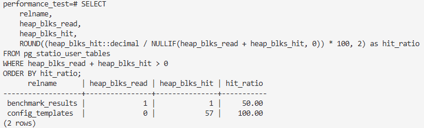

### การคำนวณ Memory Requirements

#### สูตรคำนวณพื้นฐาน

Total PostgreSQL Memory = shared_buffers + 
                         (work_mem × max_connections × sessions_per_connection) +
                         maintenance_work_mem +
                         wal_buffers +
                         other_buffers

แนะนำให้ไม่เกิน 75-80% ของ total system RAM


#### ตัวอย่างการคำนวณ

System RAM = 8GB
shared_buffers = 2GB
work_mem = 32MB
max_connections = 100
maintenance_work_mem = 512MB
wal_buffers = 64MB

Estimated Usage = 2GB + (32MB × 100 × 0.5) + 512MB + 64MB
                = 2GB + 1.6GB + 512MB + 64MB
                = 4.176GB (52% ของ system RAM) ← ปลอดภัย


## คำถามท้ายการทดลอง
1. หน่วยความจำใดบ้างที่เป็น shared memory และมีหลักในการตั้งค่าอย่างไร
ใน PostgreSQL หน่วยความจำที่อยู่ใน shared memory (ใช้ร่วมกันโดยทุก connection) ได้แก่:
shared_buffers → ใช้เก็บ page ของข้อมูลที่อ่านมาจาก disk เพื่อให้ query อื่นใช้ซ้ำได้
wal_buffers → เก็บข้อมูล WAL (Write Ahead Log) ชั่วคราวก่อนเขียนลง disk
work_mem ❌ ไม่ใช่ shared memory (เป็น per query, per connection)
maintenance_work_mem ❌ ไม่ใช่ shared memory (ใช้เฉพาะ maintenance เช่น VACUUM, CREATE INDEX)

หลักการตั้งค่า
shared_buffers ควรอยู่ที่ 25%–40% ของ RAM (ขึ้นกับ workload และ OS cache)
wal_buffers ตั้งอัตโนมัติ (ค่าดีฟอลต์เพียงพอ ส่วนมากไม่ต้องเปลี่ยน)

2. Work memory และ maintenance work memory คืออะไร มีหลักการในการกำหนดค่าอย่างไร
work_mem: หน่วยความจำที่ใช้ต่อ 1 operation เช่น sort, hash join ภายใน query
👉 ถ้ามี query ที่ซับซ้อน อาจใช้หลาย work_mem พร้อมกัน
maintenance_work_mem: หน่วยความจำที่ใช้สำหรับงานบำรุง เช่น VACUUM, CREATE INDEX, ALTER TABLE
👉 ใช้ครั้งละงาน ไม่ได้ถูกใช้พร้อมกันกับทุก connection

หลักการกำหนดค่า
work_mem → อย่าตั้งสูงเกินไป เพราะคูณกับจำนวน connection/operation ได้ง่าย → อาจกิน RAM หมด
maintenance_work_mem → ตั้งสูงได้ (เช่น 256MB–2GB) เพราะใช้งานไม่บ่อย และเฉพาะ maintenance jobs

3. หากมี RAM 16GB และต้องการกำหนด connection = 200 ควรกำหนดค่า work memory และ maintenance work memory อย่างไร
สมมติว่าให้ OS และ PostgreSQL ส่วนอื่นใช้ 4GB → เหลือ ~12GB สำหรับ work_mem + maintenance
วิธีคิด
เผื่อว่า connection อาจใช้ memory พร้อมกัน
work_mem ต่อ connection → ควรอยู่ในช่วง 32MB–64MB
maintenance_work_mem → อาจตั้ง 512MB–2GB

4. ไฟล์ postgresql.conf และ postgresql.auto.conf  มีความสัมพันธ์กันอย่างไร
ความสัมพันธ์ระหว่าง postgresql.conf และ postgresql.auto.conf
postgresql.conf → ไฟล์หลักที่เรากำหนดค่าต่าง ๆ เอง
postgresql.auto.conf → ไฟล์ที่ PostgreSQL เขียนอัตโนมัติ เมื่อเราใช้คำสั่ง

5. Buffer hit ratio คืออะไร
เป็นตัวชี้วัดว่า PostgreSQL อ่านข้อมูลจาก shared_buffers (memory) กี่ครั้ง เทียบกับจาก disk

6. แสดงผลการคำนวณ การกำหนดค่าหน่วยความจำต่าง ๆ โดยอ้างอิงเครื่องของตนเองshared_buffers = 25% RAM ≈ 4GB
work_mem = 64MB × 200 connections = 12.8GB (กรณีใช้พร้อมกันทั้งหมด)
👉 อาจเสี่ยงกิน RAM หมด ควรเผื่อ safety → ลดเหลือ 32MB ก็ได้
maintenance_work_mem = 1GB (เหมาะกับ index/vacuum ขนาดใหญ่)


7. การสแกนของฐานข้อมูล PostgreSQL มีกี่แบบอะไรบ้าง เปรียบเทียบการสแกนแต่ละแบบ
PostgreSQL มี 4 วิธีการสแกนตาราง คือ Seq Scan, Index Scan, Index Only Scan และ Bitmap Index Scan แต่ละแบบมีข้อดีข้อเสียต่างกัน เช่น Seq Scan เหมาะกับตารางเล็ก, Index Scan เร็วเมื่อดึงข้อมูลน้อย, Index Only Scan เร็วที่สุดถ้า index ครอบคลุมทุกคอลัมน์ และ Bitmap Index Scan เหมาะกับ query ที่ต้องดึงข้อมูลจำนวนมาก การเลือกใช้งาน PostgreSQL จะทำให้อัตโนมัติเพื่อประสิทธิภาพสูงสุด